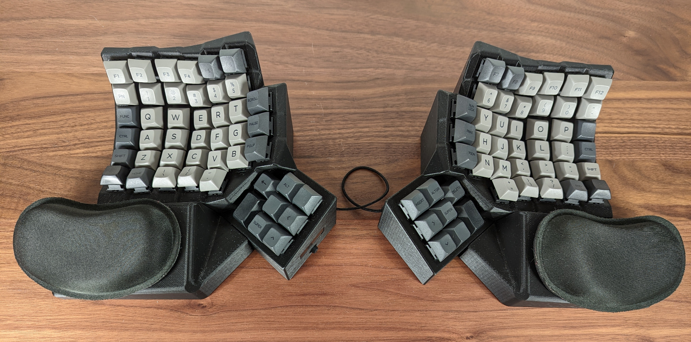

# Mantyl: concave split keyboard

This repository contains the CAD design code and firmware for my custom
keyboard.

# Keyboard Model

The `cad` directory contains code for generating the keyboard model, using
Python scripts for [Blender](https://www.blender.org/).

# Firmware

The `src` directory contains the firmware for the keyboard.  I use a
[FeatherS3](https://esp32s3.com/feathers3.html) for the microcontroller,
and the firmware code is built with the
[ESP-IDF](https://github.com/espressif/esp-idf).

# Gallery

Some more images can be found in the [img](img) directory.

# Documentation

The [doc](doc) directory contains various documentation.  The
[assembly.md](doc/assembly.md) and [wiring.md](doc/wiring.md) files may be of
interest if you are looking to print and assemble your own version of the
keyboard.

# Inspiration

I've used [Maltron](https://www.maltron.com/) keyboards for quite a long time.
My original Maltron keyboard was a PS/2 model, and back in 2013 I built my own
[keyboard controller](https://github.com/simpkins/avrpp) for it using a
[Teensy++ 2.0](https://www.pjrc.com/store/teensypp.html) microcontroller, in
order to convert it to a USB keyboard.

The layout for this keyboard is heavily influenced by the Maltron layout--I
wanted it to be fairly similar since I've used the Maltron layout for so long.

For generating the keyboard model programmatically I took some inspiration from
the [Dactyl-Manuform](https://github.com/abstracthat/dactyl-manuform) keyboard.
I initially started out using OpenSCAD, but quickly found it fairly limiting
and switched to using Python APIs for blender.  For some choices of the
electronic components, particularly the SX1509, I relied on some of the
component selection from my co-worker Wez's
[Halfdeck](https://github.com/wez/halfdeck) keyboard.
